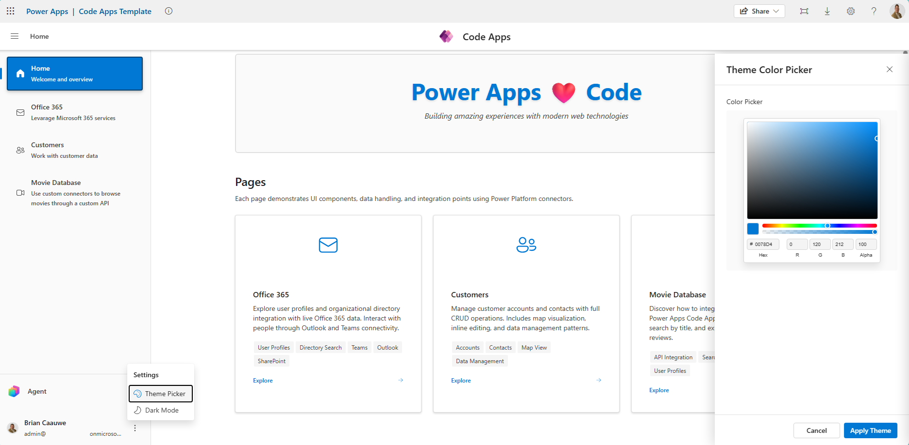
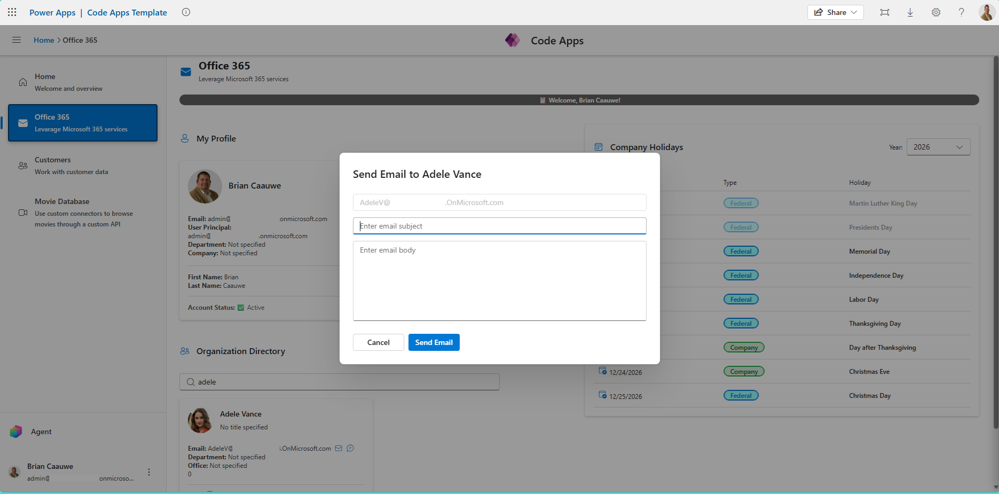
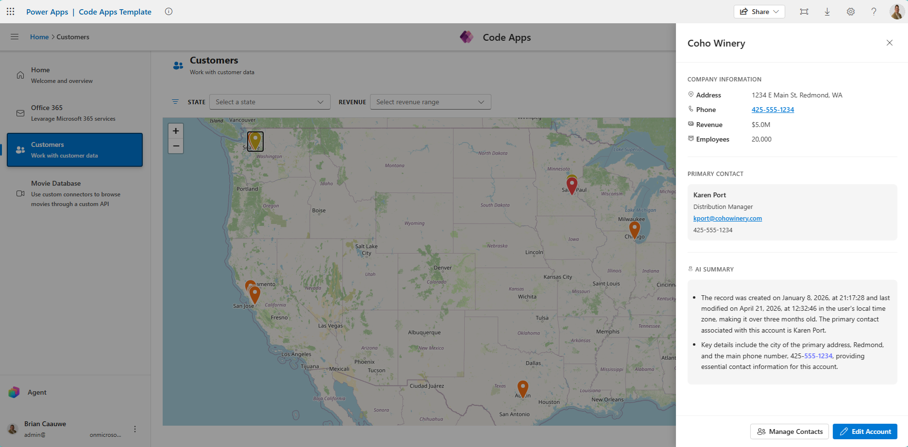
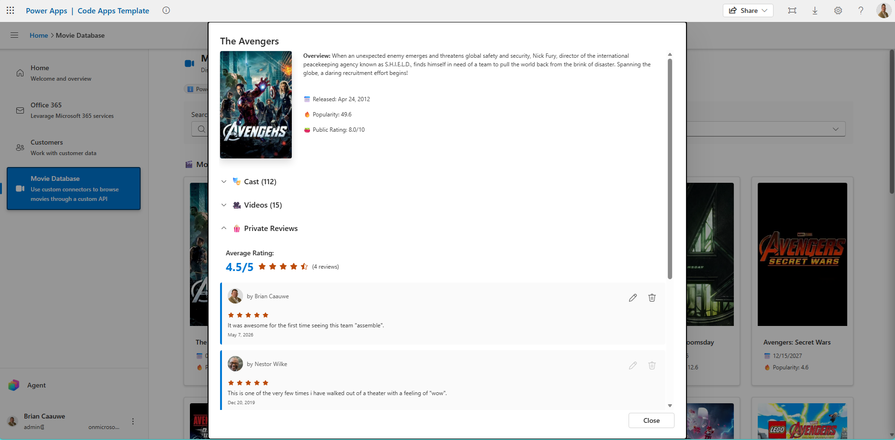
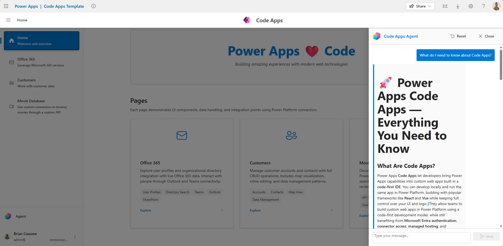

# Code Apps Demo Template

This template provides a minimal setup to get a Code App running for demonstration with live data sources.

See [instructions.md](instructions.md) for all prerequisites and getting started cloning this project.

## App Overview

The app includes four main pages, each showcasing different Power Platform connectors and Code Apps features. A left-hand navigation sidebar provides quick access to every page, and the app supports theming (including dark mode) via a built-in Theme Picker powered by Fluent UI React v9.

### Home

The landing page provides a welcome banner and card-based navigation to each section of the app. It also exposes the **Theme Picker** and **Dark Mode** toggle from the bottom-left settings menu, letting users customize the brand color applied across the entire app.

---

### Office 365

Demonstrates integration with Microsoft 365 services through multiple connectors:

- **My Profile** — Displays the signed-in user's profile using the **Office 365 Users** connector
- **Organization Directory** — Search for colleagues and view their profile details
- **Send Email** — Compose and send emails to directory users via the **Office 365 Outlook** connector
- **Send Teams Chat** — Start a Teams chat directly from the app using the **Microsoft Teams** connector
- **Company Holidays** — Displays a holiday calendar sourced from a **SharePoint Online** list and allows a user to create a calendar event in their Outlook calendar

**Data connections:** Office 365 Users, Office 365 Outlook, Microsoft Teams, SharePoint Online

---

### Customers

A full CRUD experience for Dataverse Account and Contact records:

- **Map View** — Accounts are plotted on an interactive OpenStreetMap with filterable dropdowns for state and revenue range
- **Account Details** — Click a pin to view company information, primary contact, and an **AI Summary** generated by the `AISummarizeRecord` Dataverse action
- **Edit Account** — Inline editing of account fields written back to Dataverse
- **Manage Contacts** — View, create, and edit contacts associated with an account
- **Deep Linking** — Supports URL parameters to open a specific account directly

**Data connections:** Dataverse (Account & Contact tables)
**Code Apps features:** Dataverse actions (AI summarization)

---

### Movie Database

Showcases custom connector integration by connecting to The Movie Database (TMDB) API:

- **Discover & Search** — Browse popular movies or search by title with sorting and filtering options
- **Movie Details** — View posters, overview, cast, and trailer videos (embedded YouTube)
- **Private Reviews** — Read and write movie reviews stored in an **Azure SQL Database**, with star ratings and per-user edit/delete permissions
- **Person Filmography** — Click a cast member to see their full filmography and photos

**Data connections:** TMDB (custom connector), Azure SQL (via SQL Server connector), Power Automate (cloud flow), Azure Key Vault (environment variable)
**Code Apps features:** The TMDB API key is retrieved at runtime through a **Power Automate** cloud flow that reads an environment variable **Azure Key Vault** secret

---

### Agent Panel

A slide-out conversational panel available from every page, powered by **Copilot Studio**:

- **Chat Interface** — Send messages and receive rich Markdown responses from a Copilot Studio agent
- **Session Management** — Reset the conversation to start a new session
- **Persistent Access** — The agent button is always visible in the left navigation bar
- **Silent Single-Sign On** — Automatically leverages logged in user for authorization without additional authentication prompts

**Data connections:** Microsoft Copilot Studio
**Knowledge:** Microsoft Learn
**Tools:** Dataverse MCP, Work IQ MCP

