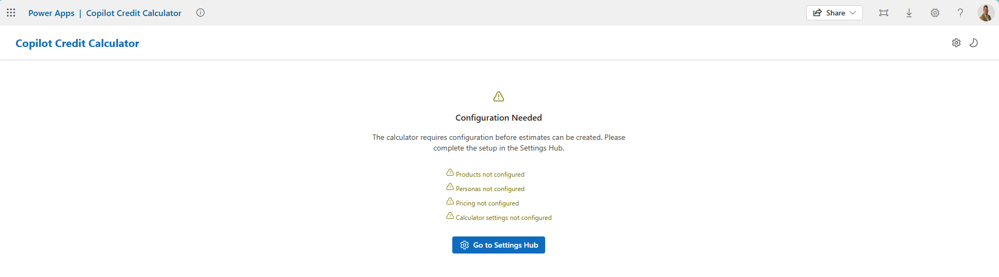

# Instructions

## System Configuration

### Developer workstation

- [Node.js LTS](https://nodejs.org/)
- [Git](https://git-scm.com/)
- Power Apps [npm CLI](https://learn.microsoft.com/en-us/power-apps/developer/code-apps/how-to/npm-quickstart) (`npx power-apps`) installed and authenticated

### Power Platform Environment

- Dataverse enabled
- Code Apps enabled

## Deployment Options

1. **Compiled**: If you want to leverage the compiled code app and don't plan on changing any code.
  - Import solution [CreditCalculatorBase_1_0_0_0.zip](solutions/CreditCalculatorBase_1_0_0_0.zip)
  - Import solution [CreditCalculatorApp_1_0_0_0_managed.zip](solutions/CreditCalculatorApp_1_0_0_0_managed.zip)
2. **Clone**: If you want to adjust the source of the Code App and deploy to your environments.
  - Import solution [CreditCalculatorBase_1_0_0_0.zip](solutions/CreditCalculatorBase_1_0_0_0.zip) (includes)

## Getting Started

### Security role assignments

The app uses Dataverse security roles to control access to admin features. After the solutions are installed, a user with the **System Administrator** security role will need to assign users and teams to the **Copilot Credit Calculator Administrator** and **Copilot Credit Calculator User** security roles from the [Power Platform Admin Center](https://aka.ms/ppac).

### Initialization

For deployment option 2 you will use the `npx power-apps` commands to clone, initialize and deploy the code app.  If you are using deployment option 1, skip to the [Importing Template Data] section

The `npx power-apps` commands authenticate via your **default browser profile**. The first time you run any command, a browser window will open to process the authentication.

> **Connecting to a different tenant?** If you need to authenticate with a tenant that doesn't match your default browser's signed-in account:
>
> 1. Run `npx power-apps logout` to clear the current session.
> 2. Set a different browser as your system default (e.g. Edge Beta) — one where only the target tenant credentials are signed in.
> 3. Run any `npx power-apps` command again. Authentication will now open in the new default browser.

Clone this project template and navigate to the folder

```bash
npx degit github:bcaauwe/CodeApps/CreditCalculator my-creditCalculator
cd my-creditCalculator
```

#### Install dependencies

Make sure you are in the project folder and use `npm` install

```bash
npm install
```

#### Initialize Code App

Initialize the project as a Code App tied to your dataverse environment.  This will generate the power.config.json file tied to your environment:

```bash
npx power-apps init --display-name "Copilot Credit Calculator" --environment-id <your environment id>
```

#### Add Data Sources

Run the following commands from the project root folder to add each Dataverse table.  When connecting to Dataverseyou will need your environment organization url (e.g. https://org***.crm.dynamics.com)

##### Calculator Estimate

```bash
npx power-apps add-data-source --api-id dataverse --resource-name gbb_calculatorestimate --org-url <your-org-url>
```

##### Calculator Estimate Line

```bash
npx power-apps add-data-source --api-id dataverse --resource-name gbb_calculatorestimateline --org-url <your-org-url>
```

##### Calculator Persona

```bash
npx power-apps add-data-source --api-id dataverse --resource-name gbb_calculatorpersona --org-url <your-org-url>
```

##### Calculator Persona Complexity

```bash
npx power-apps add-data-source --api-id dataverse --resource-name gbb_calculatorpersonacomplexity --org-url <your-org-url>
```

##### Calculator Pricing

```bash
npx power-apps add-data-source --api-id dataverse --resource-name gbb_calculatorepricing --org-url <your-org-url>
```

##### Calculator Product

```bash
npx power-apps add-data-source --api-id dataverse --resource-name gbb_calculatorproduct --org-url <your-org-url>
```

##### Calculator Product Estimate

```bash
npx power-apps add-data-source --api-id dataverse --resource-name gbb_calculatorproductestimate --org-url <your-org-url>
```

##### Calculator Setting

```bash
npx power-apps add-data-source --api-id dataverse --resource-name gbb_calculatorsetting --org-url <your-org-url>
```

#### Add Dataverse Actions

Run the following command to register the dataverse actions

##### WhoAmI

`WhoAmI` is an unbound Dataverse action used to get the system user id for the running user

```bash
npx power-apps add-dataverse-api --api-name WhoAmI
```

##### RetrieveUserPrivileges

`RetrieveUserPrivileges` is a bound Dataverse action to the `systemuser` table that returns all privileges for the user based on their user id

```bash
npx power-apps add-dataverse-api --api-name RetrieveUserPrivileges
```

### Run Locally

Start the development server

```bash
npm run dev
```

This will provide the local play URL with live connections to your Power Platform environment.

### Build

Build the app to prepare it for deployment:

```bash
npm run build
```

This compiles TypeScript and bundles the app into the `dist` folder.

### Push to Environment

When ready to deploy you can push the app to the managed host.

```bash
npx power-apps push
```

## Importing Template Data

1. Open the Copilot Credit Calculator app
2. Open the Settings Hub from the home page (this will show whenever configurations are still required)

3. Import data from the `templateData` folder in this repository into the following settings pages
  - **Products**: import `products-export.zip` using the **Import ZIP** button
  - **Personas**: import `personas.csv` using the **Import CSV** button
  - **Pricing**: import `pricing-data.csv` using the **Import CSV** button
  - **Calculator Settings**: import `calculator-settings.csv` using the **Import CSV** button and hit **Save Changes**

After data has been imported, adjust any settings based on your organizational requirements. At any time from each of the settings pages you can export files based on your current configuration to use deploying to other environments or to archive.

Once you head back to the home page, you are now ready to enter your first estimate.