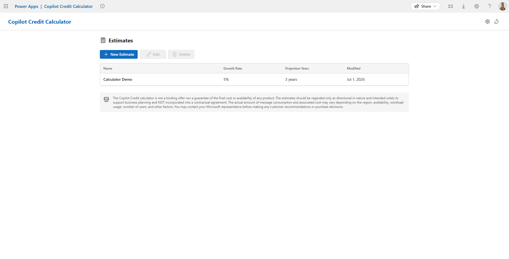
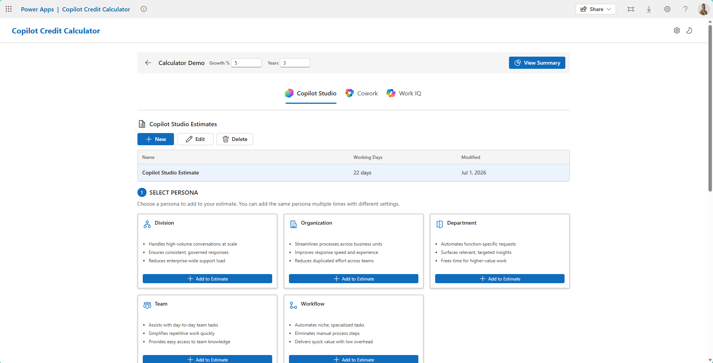
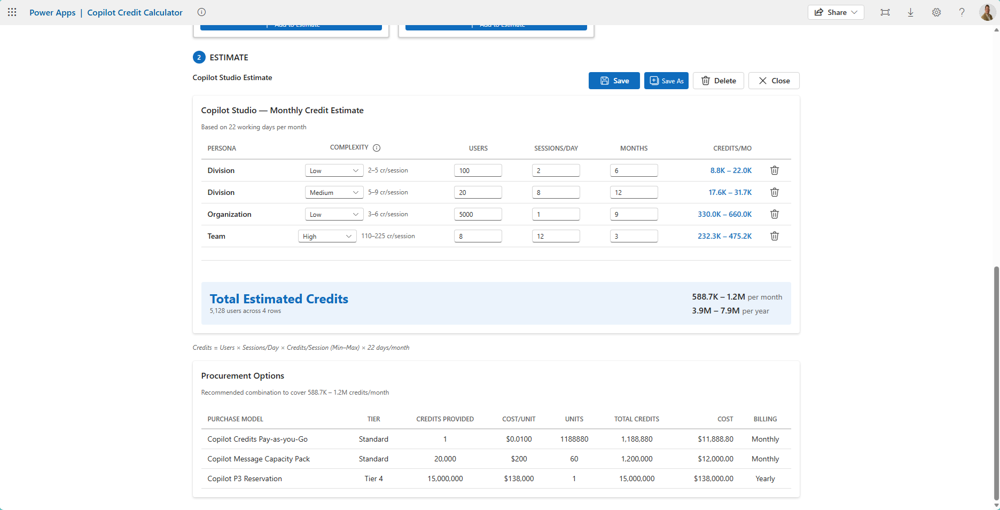
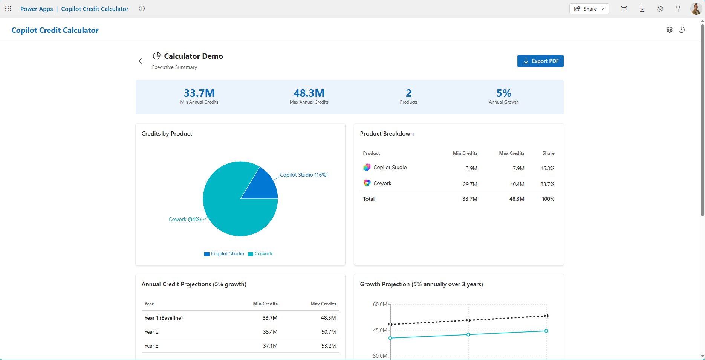
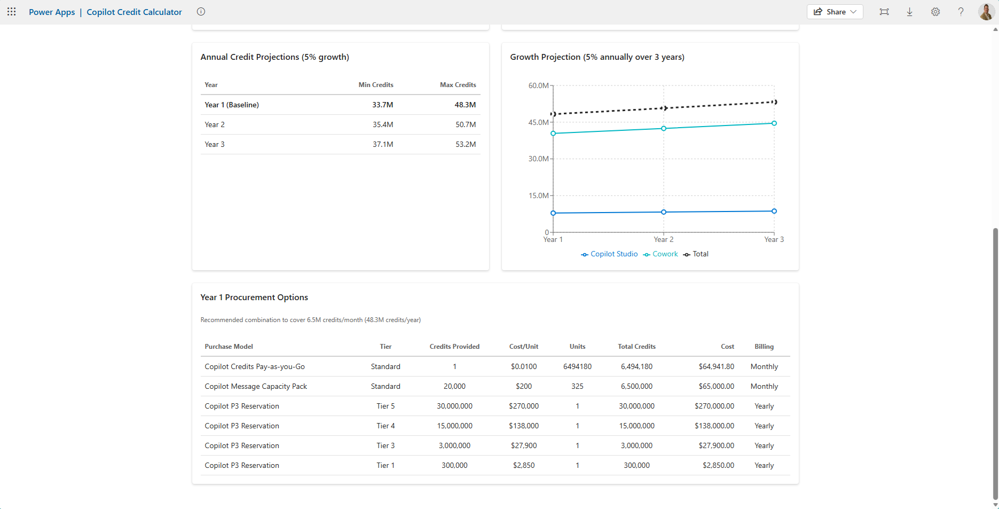
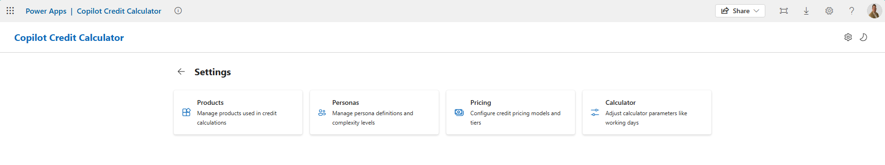
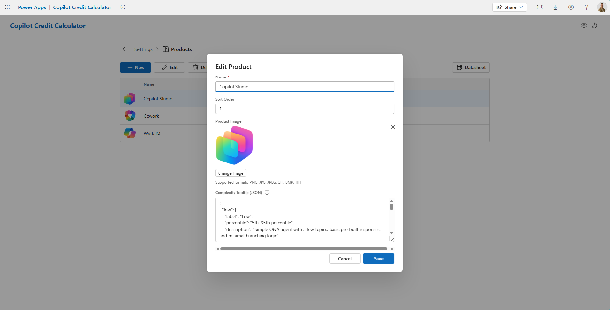
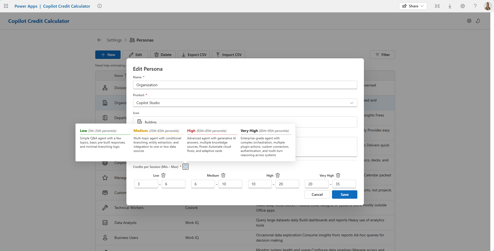
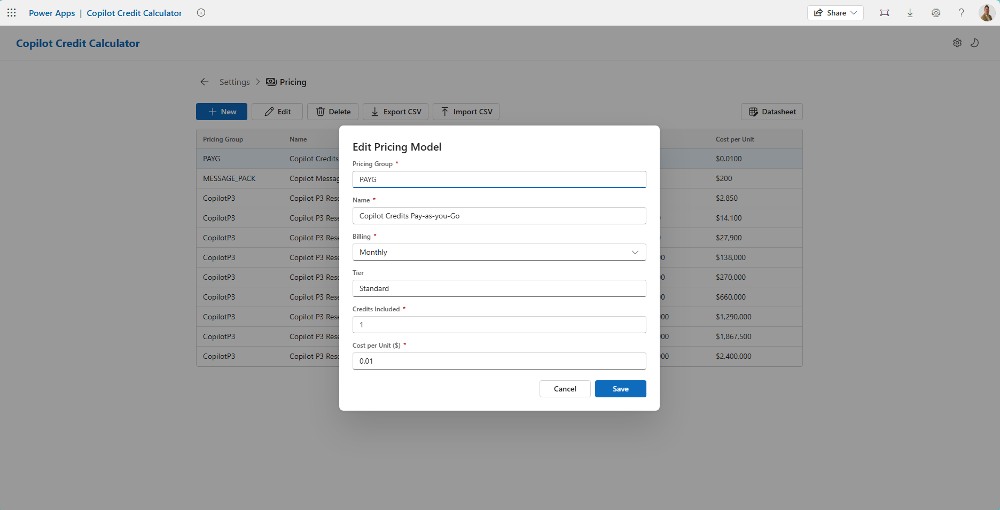
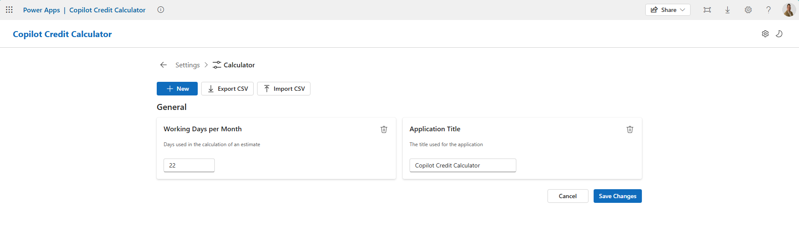

# Copilot Credit Calculator

> [!IMPORTANT]
> 🤖 **AI-Generated Code Notice**
>
> This template was generated using GitHub Copilot to demonstrate AI-assisted development workflows with Power Apps Code Apps. The code has been created for **educational and demonstration purposes only** and has not undergone detailed manual code review or security auditing.
>
> Please use this sample at your own risk and ensure proper code review, testing, and security validation before using any patterns or code in production environments.

A Power Apps Code App for estimating Copilot Credit consumption. Users select products and personas, configure complexity levels, and generate credit estimates — all backed by Dataverse. Includes an admin settings hub for managing products, personas, and pricing data, plus theming support (light/dark mode).

## Instructions

See [Instructions.md](Instructions.md) for setup, import, and deployment steps.

## Estimation Workflow

### Home Page

The landing page for the Copilot Credit Calculator. From here users can create a new estimate or load a previously saved one. The home page provides a quick overview of existing estimates and serves as the entry point into the estimation workflow.

---

### Product Estimate

After creating or opening an estimate, users select the products they want to estimate credits for. 

#### Product Estimate - Persona Configuration

For each product, one or more personas are assigned to model different usage patterns. Each persona can be configured with multiple complexity tiers with corresponding credit ranges and usage patterns, allowing users to capture a realistic spread of expected consumption.

---

#### Product Estimate - Procurement Options

The procurement section surfaces purchasing options based on the persona configuration so users can translate credit estimates into actionable procurement decisions for that product estimate.

---

### Executive Summary

The executive summary provides a high-level roll-up of the entire estimate. It also provides the ability to export the executive summary screen as a PDF document.

#### Executive Summary — Breakdown

A detailed breakdown of credit consumption across all products and personas. Visual charts (pie and line) illustrate the distribution of credits, helping executives identify which products and user groups drive the most consumption and how usage trends over time.

---

#### Executive Summary — Procurement View

The procurement view presents the total credit requirement alongside recommended credit pack quantities and pricing, giving stakeholders a clear picture of the investment needed.

---

## Administration

### Settings Hub

The centralized administration area. From the Settings Hub, admins can navigate to manage calculator settings, products, personas, and pricing. Only users with the appropriate security roles have active cards available.

---

#### Settings Hub — Products

Manage the catalog of products available for estimation. Admins can add, edit, and delete product definitions that appear in the product selection step.

---

#### Settings Hub — Personas

Define and manage user personas representing different usage profiles. Each persona includes configurable complexity tiers with min/max credit ranges, enabling granular modeling of consumption patterns.

---

#### Settings Hub — Pricing

Configure pricing tiers and per-product credit multipliers. Pricing data drives the procurement recommendations shown in the estimate table and executive summary views.

---

#### Settings Hub - Calculator Settings

Configure global application settings such as the app title, working days per month, and other parameters that affect credit calculations across all estimates.

---

## Data Connections

All data is stored in Dataverse using the following custom tables:

| Table | Purpose |
| --- | --- |
| Calculator Products | Available products |
| Calculator Personas | User persona definitions |
| Calculator Persona Complexities | Credit ranges per persona per complexity level |
| Calculator Pricings | Pricing configuration |
| Calculator Settings | Global app settings |
| Calculator Estimates | Saved estimate headers |
| Calculator Product Estimates | Per-product estimate groupings |
| Calculator Estimate Lines | Individual estimate line items |

## Security

### Security Roles

Due to the data being stored in Dataverse, the following security roles need to be configured for usage:
- **Copilot Credit Calculator Administrator**: Adminstration security role that has organizational privileges across all custom tables used throughout the solution
- **Copilot Credit Calculator User**: Security role that is intended for end users of the application with the following privileges
  - Full organizational privileges to Personas, Complexity and Pricing
  - Full user privileges to Estimates, Estimate Lines and Product Estimates
  - Read organizational privileges to Calculator settings

### Dataverse Actions

The app uses the **WhoAmI** and **RetrieveUserPrivileges** Dataverse actions to determine the current user and enforce role-based access to admin features.